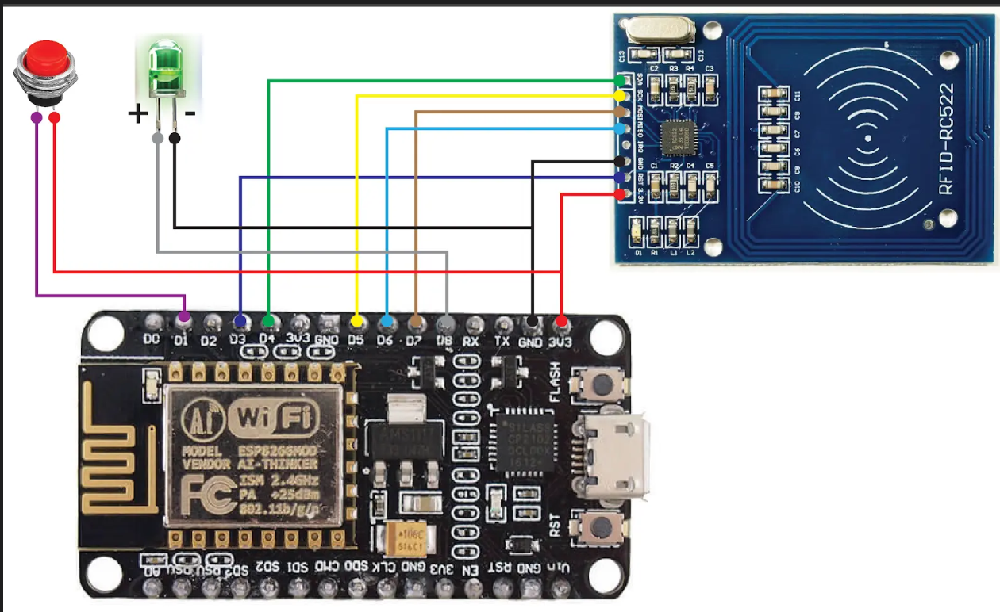

# Arduino-Based RFID Attendance System

## 📄 Overview
This project is a microcontroller-based RFID attendance system using an ESP8266 module. The system sends attendance data to a local server (XAMPP) via HTTP protocol using the `ESP8266HTTPClient` library. It includes:

- Arduino code (`absenrfid.ino`)
- SQL file for MySQL database setup
- Wiring image of the system (`Rangkaian Absen.png`)

---

## ⚙️ Setup Instructions

1. **Hardware Requirements**
   - ESP8266 (e.g., NodeMCU)
   - RFID Reader (RC522 or similar)
   - RFID Cards/Tags
   - Jumper Wires
   - Breadboard or PCB

2. **Software Requirements**
   - Arduino IDE
   - Install these libraries:
     - `ESP8266WiFi.h`
     - `ESP8266HTTPClient.h`
     - `MFRC522.h`

3. **Steps**
   - Open `absenrfid.ino` in Arduino IDE.
   - Set your Wi-Fi SSID and Password.
   - Replace the server URL with your local server IP (usually `http://192.168.x.x/absenrfid/scan.php`).
   - Upload the code to your ESP8266 board.

4. **Database Setup**
   - Launch XAMPP and start Apache & MySQL.
   - Open phpMyAdmin and import the provided SQL file to create the database and required tables.

5. **Connection**
   - The ESP8266 will connect to Wi-Fi and send scanned RFID card data to the `scan.php` endpoint on your server.

---

## ✨ Features

- Sends RFID UID data to the server via HTTP POST
- Real-time data transmission using Wi-Fi
- Compatible with MySQL database (via PHP)
- Easy to extend for doorlock or logging systems

---

## 🖼️ Circuit Diagram

---

